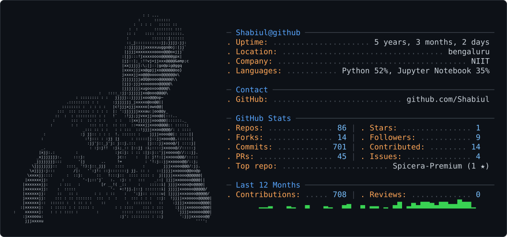

<div align="center">

  <!-- Main Animated Typing SVG Header -->
  

  <br><br>

  <!-- Dynamic Theme-Aware ASCII Profile Card (Switches dynamically between Dark & Light mode) -->
  <picture>
    <source media="(prefers-color-scheme: dark)" srcset="./dark_mode.svg">
    <source media="(prefers-color-scheme: light)" srcset="./light_mode.svg">
    
  </picture>

  <br><br>

  <!-- Profile Metrics Badges -->
  <a href="https://github.com/shabiul">
    
  </a>
  <a href="https://github.com/shabiul?tab=followers">
    
  </a>
  <a href="https://github.com/shabiul?tab=repositories&sort=stargazers">
    
  </a>

  <br><br>

  <!-- Fast Navigation Links -->
  <p align="center">
    <a href="#-whoami"><b>About Me</b></a> •
    <a href="#-key-achievements"><b>Achievements</b></a> •
    <a href="#-featured-projects"><b>Projects</b></a> •
    <a href="#-tech-ecosystem"><b>Tech Stack</b></a> •
    <a href="#-experience--internships"><b>Experience</b></a> •
    <a href="#-github-intelligence"><b>Analytics</b></a> •
    <a href="#-lets-connect"><b>Connect</b></a>
  </p>

</div>

---

## 🧠 `whoami`

```python
class ShabiulHasnainSiddiqui:
    def __init__(self):
        self.role = "AI Systems Engineer & Full-Stack Developer"
        self.location = "Kanpur, India"
        self.education = "B.E. in Artificial Intelligence & Machine Learning (2021-2025)"
        self.focus_domains = [
            "Offline LLM Inference & Local Model Serving",
            "Model Context Protocol (MCP) & Claude CLI Tool Automation",
            "Multimodal Speech-to-Avatar Pipelines (TTS, RVC, Wav2Lip)",
            "Real-Time Event-Driven Backend Systems (WebSockets, Redis)"
        ]

    def current_status(self) -> dict:
        return {
            "current_role": "AI / Software Intern at NIIT MTS",
            "active_systems": "Offline LLM inference pipelines with Ollama & Qwen3-Coder 30B",
            "stack": ["Python", "TypeScript", "Node.js", "Next.js", "Redis", "Docker"],
            "open_for": "Full-time AI Systems, GenAI, and Full-Stack Engineering roles"
        }
```

<br>

<div align="center">
<table>
<tr>
<td width="50%" valign="top">

### 🤖 What I Excel At
- ⚡ **Offline LLM Deployment**: High-performance local inference via Ollama & Qwen3-Coder 30B with zero external cloud dependencies.
- 🔌 **Tool-Augmented Workflows**: Integrating Model Context Protocol (**MCP**) and CLI agents for intelligent developer tooling.
- 🎙️ **Multimodal Pipelines**: Speech synthesis and lip-synced animated avatars using XTTSv2, RVC, and Wav2Lip.
- 🚀 **Scalable Backends**: Distributed WebSocket synchronization, pub/sub architectures, and sub-millisecond Redis caching.

</td>
<td width="50%" valign="top">

### 💡 Quick Snapshot
- 🔭 **Current Focus**: Architecting tool orchestration layers with Node.js & local model runtimes.
- 🏆 **Hackathons**: 2nd Runner-up at Visionet Techathon 2023 for **Money Magnet**.
- 📊 **Competitive Coding**: Top 4% (Rank 653 / 16,837) in Newton School Coding Challenge.
- 💬 **Ask Me About**: Offline AI pipelines, speech/vision synthesis, and low-latency Node/Next.js architectures.

</td>
</tr>
</table>
</div>

---

## 🏆 Key Achievements

<div align="center">
<table>
<tr>

<td width="33%" align="center" valign="top">
<h3>🥈 Hackathon Winner</h3>

<br><br>
<b>Visionet Techathon 2023</b>
<p>Awarded 2nd Runner-up for building <b>Money Magnet</b>, a fintech platform handling 10,000+ daily transactions with WebSockets & Redis.</p>
</td>

<td width="33%" align="center" valign="top">
<h3>🧠 Offline AI Infrastructure</h3>

<br><br>
<b>Local LLM & MCP Pipeline</b>
<p>Architected offline inference pipelines using <b>Ollama & Qwen3-Coder 30B</b>, eliminating cloud API costs and integrating MCP tooling.</p>
</td>

<td width="33%" align="center" valign="top">
<h3>⚡ Competitive Coding</h3>

<br><br>
<b>Newton School Contest</b>
<p>Secured rank <b>653 out of 16,837</b> competing developers nationwide, demonstrating strong algorithm and data structure fundamentals.</p>
</td>

</tr>
</table>
</div>

---

## 🔥 Featured Projects

### 01. 🗣️ Real-Time Multimodal AI Avatar System
> **End-to-end multimodal pipeline integrating voice synthesis, voice cloning, and audio-driven lip synchronization.**

```
[ Input Text / Audio ] ──► [ XTTSv2 Voice Synthesis ] ──► [ RVC Voice Conversion ]
                                                                   │
                                                                   ▼
[ Real-Time Animated Avatar ] ◄── [ Latency Optimization ] ◄── [ Wav2Lip Video Engine ]
```

- 🎙️ **Voice Cloning & Synthesis**: Integrated **XTTSv2** and **RVC** for ultra-expressive, low-latency audio generation.
- 🎬 **Neural Lip-Syncing**: Deployed **Wav2Lip** on benchmark datasets (**VCTK** & **LRS2**) for frame-accurate facial alignment.
- ⚡ **Low-Latency Interaction**: Streamlined intermediate representation pipelines for real-time responsiveness.

<p align="left">
  
  
  
  
  
</p>

<a href="https://github.com/shabiul">
  
</a>

<br><br>

---

### 02. ✈️ AI Travel Planner
> **Intelligent itinerary generation and travel advisory engine powered by Gemini API & natural language reasoning.**

- 🧠 **Dynamic Itinerary Planning**: Parses freeform natural language prompts to craft complete day-by-day travel schedules.
- 🌦️ **Context-Aware Recommendations**: Factorizes live constraints such as budget limits, weather data, and geographical routes.
- ⏱️ **40% Faster Scheduling**: Reduced traditional manual trip planning time by ~40% through automated preference mapping.

<p align="left">
  
  
  
  
</p>

<a href="https://github.com/shabiul">
  
</a>

<br><br>

---

### 03. 💰 Money Magnet — High-Throughput Financial Platform
> **Award-winning fintech web platform built for high-concurrency transaction processing and real-time syncing.**

- 📈 **High-Scale Concurrency**: Architected to seamlessly process **10,000+ daily transactions** with **99.9% uptime**.
- ⚡ **Real-Time Data Streaming**: Leveraged **WebSockets** and **Redis caching** to support **2,000+ simultaneous sessions** without UI lag.
- 🏆 **Recognized Excellence**: Clinched **2nd Runner-up** honors at the **Visionet Techathon 2023**.

<p align="left">
  
  
  
  
  
</p>

<a href="https://github.com/shabiul">
  
</a>

---

## 🧩 Tech Ecosystem

<div align="center">

  <!-- Interactive SVG Icon Ribbon -->
  <a href="https://skillicons.dev">
    
  </a>

</div>

<br>

<div align="center">
<table>
<tr>
<th align="left">Domain</th>
<th align="left">Technologies, Tools & Frameworks</th>
</tr>
<tr>
<td><b>🧠 AI, LLMs & Local Inference</b></td>
<td><code>Ollama</code> • <code>Qwen3-Coder 30B</code> • <code>MCP Protocol</code> • <code>Gemini API</code> • <code>RAG</code> • <code>LangChain</code> • <code>TensorFlow</code> • <code>scikit-learn</code></td>
</tr>
<tr>
<td><b>🎙️ Audio & Vision Generation</b></td>
<td><code>XTTSv2</code> • <code>RVC (Retrieval-based Voice Conversion)</code> • <code>Wav2Lip</code> • <code>NLP</code> • <code>VCTK / LRS2 Datasets</code></td>
</tr>
<tr>
<td><b>⚙️ Backend & Architecture</b></td>
<td><code>Node.js</code> • <code>RESTful APIs</code> • <code>WebSockets</code> • <code>Redis Caching</code> • <code>Java</code> • <code>Streamlit</code></td>
</tr>
<tr>
<td><b>🌐 Frontend & Web</b></td>
<td><code>Next.js (App Router)</code> • <code>React</code> • <code>TypeScript</code> • <code>JavaScript</code> • <code>Tailwind CSS</code></td>
</tr>
<tr>
<td><b>🗄️ Databases & Cloud</b></td>
<td><code>MongoDB</code> • <code>PostgreSQL / SQL</code> • <code>Supabase</code> • <code>Azure</code> • <code>Docker</code> • <code>Linux</code> • <code>Git</code></td>
</tr>
</table>
</div>

---

## 💼 Experience & Internships

#### 🚀 **AI / Software Intern** · **NIIT MTS**
*📅 Feb 2026 — Present | 📍 India*
- Architected and deployed offline LLM inference pipelines utilizing **Ollama** and **Qwen3-Coder 30B**.
- Integrated the **Model Context Protocol (MCP)** with Claude Code CLI for tool-augmented autonomous developer workflows.
- Developed the Node.js backend orchestration layer handling communication between tools and AI models.
- Optimized local model throughput, significantly cutting latency and eliminating cloud API dependencies.

#### ⚙️ **ML & Full Stack Developer** · **Roam My Way**
*📅 Feb 2025 — Apr 2025*
- Integrated machine learning models into production Next.js applications with resilient REST APIs.
- Optimized backend data pipelines for real-time model inference and user preference evaluation.

#### 📊 **Data Scientist** · **Quad Power Systems**
*📅 Oct 2023 — Nov 2023*
- Developed predictive ML models for foot pressure analysis and battery health forecasting.
- Built interactive analytics dashboards using **Streamlit** for real-time telemetry and engineering insights.

---

## 🎓 Education

* **Bachelor of Engineering in Artificial Intelligence & Machine Learning (AI & ML)**  
  **The Oxford College of Engineering** *(2021 — 2025)*  
  *CGPA: 7.2 / 10*

---

## 📊 GitHub Intelligence

<div align="center">

  <!-- Main GitHub Stats & Languages Side-by-Side -->
  
  

  <br><br>

  <!-- GitHub Streak Counter -->
  

</div>

<br>

## 🐍 Contribution Matrix

<div align="center">

  

</div>

---

## 📫 Let's Connect

<div align="center">

  <p>I'm always eager to collaborate on offline AI pipelines, multimodal systems, and high-performance backend infrastructure.</p>

  <a href="https://linkedin.com/in/shabiul" target="_blank">
    
  </a>
  <a href="mailto:shabiulhasnain33@gmail.com">
    
  </a>
  <a href="https://github.com/shabiul" target="_blank">
    
  </a>

  <br><br>

  <!-- Dynamic Waving Footer -->
  

</div>
